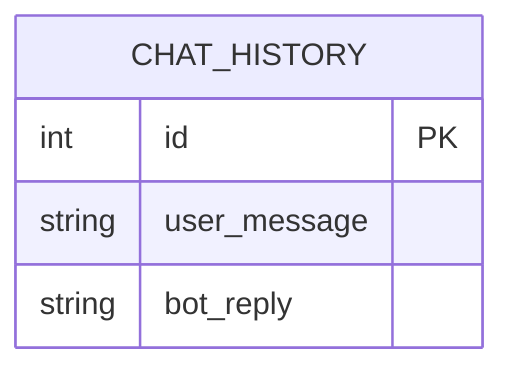

# TechnoPath SEAIT Campus Guide - System Diagrams

## Table of Contents
1. [Functional Decomposition Diagram (FDD)](#1-functional-decomposition-diagram-fdd)
2. [Entity Relationship Diagrams (ERD)](#2-entity-relationship-diagrams-erd)
   - [Main Django Database](#21-main-django-database-erd)
   - [Flask Chatbot Database](#22-flask-chatbot-database-erd)
3. [Use Case Diagram](#3-use-case-diagram)

---

## 1. Functional Decomposition Diagram (FDD)

```mermaid
graph TD
    A[TechnoPath SEAIT Campus Guide] --> B[Frontend - Vue.js PWA]
    A --> C[Backend - Django REST API]
    A --> D[Chatbot Service - Flask]
    
    %% Frontend Module
    B --> B1[User Interface Layer]
    B --> B2[Navigation Layer]
    B --> B3[Map & Location Layer]
    B --> B4[Communication Layer]
    B --> B5[Administration Layer]
    
    B1 --> B1a[HomeView - Campus Dashboard]
    B1 --> B1b[SplashScreen - App Entry]
    B1 --> B1c[ProfileView - User Profile]
    B1 --> B1d[SettingsView - App Preferences]
    
    B2 --> B2a[NavigateView - Pathfinding]
    B2 --> B2b[QRScannerView - Quick Access]
    B2 --> B2c[FavoritesView - Saved Locations]
    
    B3 --> B3a[MapView - Interactive Campus Map]
    B3 --> B3b[InfoView - Building/Room Details]
    
    B4 --> B4a[ChatbotView - AI Assistant]
    B4 --> B4b[NotificationsView - Push Notifications]
    B4 --> B4c[FeedbackView - Ratings & Comments]
    
    B5 --> B5a[AdminView - Admin Panel]
    B5 --> B5b[AdminLoginView - Secure Access]
    
    B5a --> B5a1[AdminDashboard - Analytics & Stats]
    B5a --> B5a2[AdminFacilities - Building Management]
    B5a --> B5a3[AdminRooms - Room Management]
    B5a --> B5a4[AdminNavGraph - Navigation Nodes/Edges]
    B5a --> B5a5[AdminFAQ - Chatbot Knowledge Base]
    B5a --> B5a6[AdminAnnouncements - Publish/Approve]
    B5a --> B5a7[AdminSendNotification - Push Notifications]
    B5a --> B5a8[AdminAccounts - Admin User Management]
    B5a --> B5a9[AdminFeedback - Review User Feedback]
    B5a --> B5a10[AdminAuditLog - Activity Tracking]
    B5a --> B5a11[AdminPendingApprovals - Workflow Management]
    
    %% Backend Module
    C --> C1[User Management Module]
    C --> C2[Campus Data Module]
    C --> C3[Navigation Module]
    C --> C4[Communication Module]
    C --> C5[Analytics & Audit Module]
    
    C1 --> C1a[AdminUser Model - Authentication]
    C1 --> C1b[JWT Token Management]
    C1 --> C1c[Permission System - RBAC]
    C1 --> C1d[Account Lockout Security]
    
    C2 --> C2a[Facility Model - Buildings]
    C2 --> C2b[Room Model - Classrooms/Offices]
    C2 --> C2c[Department Model - Organization Units]
    C2 --> C2d[MapMarker Model - Map Coordinates]
    
    C3 --> C3a[NavigationNode Model - Path Points]
    C3 --> C3b[NavigationEdge Model - Path Connections]
    C3 --> C3c[A* Pathfinding Algorithm]
    
    C4 --> C4a[Announcement Model - Dept Communications]
    C4 --> C4b[Notification Model - Push Messages]
    C4 --> C4c[FAQEntry Model - Chatbot Knowledge]
    C4 --> C4d[AIChatLog Model - Conversation History]
    
    C5 --> C5a[AdminAuditLog Model - Activity Logging]
    C5 --> C5b[Rating Model - User Ratings]
    C5 --> C5c[Feedback Model - User Feedback]
    C5 --> C5d[SearchHistory Model - Search Analytics]
    C5 --> C5e[AppUsage Model - Usage Statistics]
    C5 --> C5f[UsageAnalytics Model - Event Tracking]
    C5 --> C5g[DevicePreference Model - User Settings]
    C5 --> C5h[ConnectivityLog Model - Network Status]
    C5 --> C5i[AppConfig Model - System Settings]
    
    %% Chatbot Module
    D --> D1[Natural Language Processing]
    D --> D2[Knowledge Base]
    D --> D3[Conversation Management]
    
    D1 --> D1a[Intent Recognition]
    D1 --> D1b[Keyword Matching]
    D1 --> D1c[Greeting Detection]
    
    D2 --> D2a[CAMPUS_KNOWLEDGE Dictionary]
    D2 --> D2b[CLASSROOM_BUILDINGS Mapping]
    D2 --> D2c[FAQ Database Integration]
    
    D3 --> D3a[Chat History Storage]
    D3 --> D3b[Context Awareness]
    D3 --> D3c[Response Generation]
```

---

## 2. Entity Relationship Diagrams (ERD)

### 2.1 Main Django Database ERD

```mermaid
erDiagram
    %% Core User Management
    ADMIN_USER {
        int id PK
        string username UK
        string email
        string display_name
        string role "super_admin|dean|program_head|basic_ed_head"
        string department
        string department_label
        boolean is_active
        boolean is_staff
        int login_attempts
        datetime locked_until
        datetime last_login
        datetime created_at
        datetime updated_at
    }
    
    %% Department & Organization
    DEPARTMENT {
        int id PK
        string name
        string code UK
        string description
        int head_user_id FK
        boolean is_active
        datetime created_at
    }
    
    %% Campus Facilities
    FACILITY {
        int id PK
        string name
        string code UK
        string description
        string building_code
        int department_id FK
        float latitude
        float longitude
        string image_path
        string map_svg_id
        int total_floors
        boolean is_deleted
        boolean is_active
        datetime created_at
        datetime updated_at
    }
    
    %% Rooms within Facilities
    ROOM {
        int id PK
        int facility_id FK
        string name
        string code
        string room_number
        string description
        int floor
        string map_svg_id
        string room_type "classroom|office|lab|facility|staircase|restroom|other"
        int capacity
        boolean is_office
        boolean is_crucial
        int search_count
        boolean is_deleted
        boolean is_active
        datetime created_at
        datetime updated_at
    }
    
    %% Navigation Graph
    NAVIGATION_NODE {
        int id PK
        string name
        string node_type "room|facility|waypoint|entrance|staircase|elevator|junction"
        int facility_id FK
        int room_id FK
        string map_svg_id
        float x
        float y
        int floor
        boolean is_deleted
        datetime created_at
        datetime updated_at
    }
    
    NAVIGATION_EDGE {
        int id PK
        int from_node_id FK
        int to_node_id FK
        int distance
        boolean is_bidirectional
        boolean is_deleted
        datetime created_at
        datetime updated_at
    }
    
    %% Map Elements
    MAP_MARKER {
        int id PK
        int facility_id FK
        int room_id FK
        string name
        float x_position
        float y_position
        string marker_type "facility|room|entrance|waypoint|amenity"
        string icon_name
        string color_hex
        boolean is_active
        datetime created_at
    }
    
    MAP_LABEL {
        int id PK
        string label_text
        float x_position
        float y_position
        int font_size
        string color_hex
        float rotation
        boolean is_active
        datetime created_at
    }
    
    %% Communication - Announcements
    ANNOUNCEMENT {
        int id PK
        string title
        string content
        int created_by_id FK
        string source_label
        string source_color
        string scope "campus_wide|all_college|basic_ed_only|department"
        string target_department
        string status "pending_approval|published|rejected|archived"
        boolean requires_approval
        int approved_by_id FK
        int rejected_by_id FK
        string rejection_note
        datetime approved_at
        int archived_by_id FK
        datetime archived_at
        boolean is_deleted
        datetime created_at
        datetime updated_at
    }
    
    %% Communication - Notifications
    NOTIFICATION {
        int id PK
        string title
        string message
        string type "announcement|info|emergency|facility_update|room_update|system_maintenance|app_update"
        string source_label
        string source_color
        int announcement_id FK
        int priority "1-4"
        boolean is_read
        datetime expires_at
        int created_by_id FK
        datetime created_at
    }
    
    %% Chatbot
    FAQ_ENTRY {
        int id PK
        string question
        string answer
        string category "location|schedule|academic|services|general"
        string keywords
        int usage_count
        boolean is_deleted
        datetime created_at
        datetime updated_at
    }
    
    AI_CHAT_LOG {
        int id PK
        string user_query
        string ai_response
        string mode "online|offline"
        int response_time_ms
        boolean is_successful
        string error_message
        int faq_entry_id FK
        string session_id
        datetime created_at
    }
    
    %% Feedback & Ratings
    RATING {
        int id PK
        int user_id FK
        int facility_id FK
        int room_id FK
        int rating "1-5"
        string comment
        string category "general|facility|room|navigation|app"
        boolean is_anonymous
        boolean is_active
        datetime created_at
    }
    
    FEEDBACK {
        int id PK
        int rating "1-5"
        string comment
        string category "map_accuracy|ai_chatbot|navigation|general|bug_report|facility|room"
        int facility_id FK
        int room_id FK
        boolean is_flagged
        string flag_reason
        datetime created_at
    }
    
    FEEDBACK_FLAG {
        int id PK
        int user_id FK
        int rating_id FK
        string reason
        string status "pending|reviewed|resolved|dismissed"
        int resolved_by_id FK
        datetime resolved_at
        datetime created_at
    }
    
    %% Analytics & Audit
    ADMIN_AUDIT_LOG {
        int id PK
        int admin_id FK
        string action "login|logout|create|update|soft_delete|restore|approve|reject|publish|reset_password"
        string entity_type
        int entity_id
        string entity_label
        string old_value_json
        string new_value_json
        string ip_address
        datetime created_at
    }
    
    SEARCH_HISTORY {
        int id PK
        int user_id FK
        string query
        int results_count
        boolean was_clicked
        datetime created_at
    }
    
    APP_USAGE {
        int id PK
        int user_id FK
        date session_date
        int session_duration "seconds"
        int screen_views
        datetime created_at
    }
    
    USAGE_ANALYTICS {
        int id PK
        int user_id FK
        string event_type "screen_view|search|navigation|rating|feedback|share|notification_open"
        json event_data
        string screen_name
        string session_id
        datetime created_at
    }
    
    %% Preferences & Config
    DEVICE_PREFERENCE {
        int id PK
        int user_id FK
        string device_id
        boolean dark_mode
        string language
        float font_scale
        boolean high_contrast
        boolean reduce_animations
        datetime last_sync
        datetime created_at
    }
    
    NOTIFICATION_TYPE {
        int id PK
        string name UK
        string description
        string icon_name
        string color_hex
        boolean is_active
        datetime created_at
    }
    
    NOTIFICATION_PREFERENCE {
        int id PK
        int user_id FK
        int notification_type_id FK
        boolean is_enabled
        datetime created_at
    }
    
    APP_CONFIG {
        int id PK
        string config_key UK
        string config_value
        string description
        int updated_by_id FK
        datetime updated_at
    }
    
    CONNECTIVITY_LOG {
        int id PK
        int user_id FK
        boolean is_online
        string connection_type
        int latency_ms
        string error_message
        datetime created_at
    }
    
    %% Relationships
    ADMIN_USER ||--o{ DEPARTMENT : "heads"
    ADMIN_USER ||--o{ ANNOUNCEMENT : "creates"
    ADMIN_USER ||--o{ ANNOUNCEMENT : "approves"
    ADMIN_USER ||--o{ ANNOUNCEMENT : "rejects"
    ADMIN_USER ||--o{ ANNOUNCEMENT : "archives"
    ADMIN_USER ||--o{ NOTIFICATION : "creates"
    ADMIN_USER ||--o{ RATING : "submits"
    ADMIN_USER ||--o{ FEEDBACK_FLAG : "flags"
    ADMIN_USER ||--o{ FEEDBACK_FLAG : "resolves"
    ADMIN_USER ||--o{ ADMIN_AUDIT_LOG : "performs actions"
    ADMIN_USER ||--o{ SEARCH_HISTORY : "performs"
    ADMIN_USER ||--o{ APP_USAGE : "generates"
    ADMIN_USER ||--o{ USAGE_ANALYTICS : "generates"
    ADMIN_USER ||--o{ DEVICE_PREFERENCE : "has"
    ADMIN_USER ||--o{ NOTIFICATION_PREFERENCE : "has"
    ADMIN_USER ||--o{ APP_CONFIG : "updates"
    ADMIN_USER ||--o{ CONNECTIVITY_LOG : "logs"
    
    DEPARTMENT ||--o{ FACILITY : "contains"
    
    FACILITY ||--o{ ROOM : "contains"
    FACILITY ||--o{ NAVIGATION_NODE : "has"
    FACILITY ||--o{ MAP_MARKER : "marked on"
    FACILITY ||--o{ RATING : "rated in"
    FACILITY ||--o{ FEEDBACK : "referenced in"
    
    ROOM ||--o{ NAVIGATION_NODE : "has"
    ROOM ||--o{ MAP_MARKER : "marked on"
    ROOM ||--o{ RATING : "rated in"
    ROOM ||--o{ FEEDBACK : "referenced in"
    
    NAVIGATION_NODE ||--o{ NAVIGATION_EDGE : "from_node"
    NAVIGATION_NODE ||--o{ NAVIGATION_EDGE : "to_node"
    
    ANNOUNCEMENT ||--o{ NOTIFICATION : "generates"
    
    FAQ_ENTRY ||--o{ AI_CHAT_LOG : "matched to"
    
    RATING ||--o{ FEEDBACK_FLAG : "flagged"
    
    NOTIFICATION_TYPE ||--o{ NOTIFICATION_PREFERENCE : "has preferences"
```

---

### 2.2 Flask Chatbot Database ERD

**Note:** The Flask chatbot uses a minimal SQLite database with a single table for conversation history. The knowledge base is stored in-memory as Python dictionaries (`CAMPUS_KNOWLEDGE` and `CLASSROOM_BUILDINGS`).

---

## 3. Use Case Diagram

```mermaid
graph LR
    %% Actors
    STUDENT([Student])
    VISITOR([Campus Visitor])
    FACULTY([Faculty/Staff])
    SUPER_ADMIN([Super Admin<br/>Safety & Security])
    DEAN([College Dean])
    PROGRAM_HEAD([Program Head])
    BASIC_ED_HEAD([Basic Ed Head])
    
    %% Use Cases - Campus Navigation
    subgraph "Campus Navigation"
        UC1[View Interactive Campus Map]
        UC2[Search Buildings & Rooms]
        UC3[Get Turn-by-Turn Directions]
        UC4[Scan QR Code for Quick Access]
        UC5[View Building Information]
        UC6[View Room Details]
        UC7[Save Favorite Locations]
        UC8[View Floor Plans]
    end
    
    %% Use Cases - AI Assistance
    subgraph "AI Assistance"
        UC9[Chat with Campus Guide Bot]
        UC10[Ask Location Questions]
        UC11[Get Navigation Help]
        UC12[Receive AI Suggestions]
    end
    
    %% Use Cases - Communication
    subgraph "Communication & Notifications"
        UC13[View Announcements]
        UC14[Receive Push Notifications]
        UC15[Check Notification History]
        UC16[Submit Feedback/Ratings]
        UC17[Report Issues]
    end
    
    %% Use Cases - User Management (Admin)
    subgraph "Admin - User Management"
        UC18[Login to Admin Panel]
        UC19[Manage Admin Accounts]
        UC20[View Audit Logs]
        UC21[Reset User Passwords]
        UC22[Manage User Permissions]
    end
    
    %% Use Cases - Content Management (Admin)
    subgraph "Admin - Content Management"
        UC23[Manage Facilities/Buildings]
        UC24[Manage Rooms]
        UC25[Manage Navigation Graph]
        UC26[Manage FAQ/Knowledge Base]
        UC27[Upload Map Images]
        UC28[Configure Map Markers]
    end
    
    %% Use Cases - Communication Management (Admin)
    subgraph "Admin - Communication"
        UC29[Create Announcement]
        UC30[Approve/Reject Announcements]
        UC31[Send Push Notifications]
        UC32[Archive Old Announcements]
    end
    
    %% Use Cases - Analytics (Admin)
    subgraph "Admin - Analytics & Reports"
        UC33[View Dashboard Statistics]
        UC34[Review User Feedback]
        UC35[Analyze Usage Analytics]
        UC36[Track Search Patterns]
        UC37[Monitor Chatbot Performance]
        UC38[Export Reports]
    end
    
    %% Student/Vistor/Faculty Connections
    STUDENT --> UC1
    STUDENT --> UC2
    STUDENT --> UC3
    STUDENT --> UC4
    STUDENT --> UC5
    STUDENT --> UC6
    STUDENT --> UC7
    STUDENT --> UC8
    STUDENT --> UC9
    STUDENT --> UC10
    STUDENT --> UC11
    STUDENT --> UC12
    STUDENT --> UC13
    STUDENT --> UC14
    STUDENT --> UC15
    STUDENT --> UC16
    STUDENT --> UC17
    
    VISITOR --> UC1
    VISITOR --> UC2
    VISITOR --> UC3
    VISITOR --> UC4
    VISITOR --> UC5
    VISITOR --> UC6
    VISITOR --> UC9
    VISITOR --> UC10
    VISITOR --> UC11
    VISITOR --> UC13
    VISITOR --> UC14
    
    FACULTY --> UC1
    FACULTY --> UC2
    FACULTY --> UC3
    FACULTY --> UC4
    FACULTY --> UC5
    FACULTY --> UC6
    FACULTY --> UC7
    FACULTY --> UC8
    FACULTY --> UC9
    FACULTY --> UC13
    FACULTY --> UC14
    FACULTY --> UC16
    FACULTY --> UC18
    
    %% Admin Connections - Super Admin (Full Access)
    SUPER_ADMIN --> UC18
    SUPER_ADMIN --> UC19
    SUPER_ADMIN --> UC20
    SUPER_ADMIN --> UC21
    SUPER_ADMIN --> UC22
    SUPER_ADMIN --> UC23
    SUPER_ADMIN --> UC24
    SUPER_ADMIN --> UC25
    SUPER_ADMIN --> UC26
    SUPER_ADMIN --> UC27
    SUPER_ADMIN --> UC28
    SUPER_ADMIN --> UC29
    SUPER_ADMIN --> UC30
    SUPER_ADMIN --> UC31
    SUPER_ADMIN --> UC32
    SUPER_ADMIN --> UC33
    SUPER_ADMIN --> UC34
    SUPER_ADMIN --> UC35
    SUPER_ADMIN --> UC36
    SUPER_ADMIN --> UC37
    SUPER_ADMIN --> UC38
    
    %% Admin Connections - Dean
    DEAN --> UC18
    DEAN --> UC20
    DEAN --> UC29
    DEAN --> UC30
    DEAN --> UC31
    DEAN --> UC32
    DEAN --> UC33
    DEAN --> UC34
    DEAN --> UC35
    DEAN --> UC36
    DEAN --> UC37
    DEAN --> UC38
    
    %% Admin Connections - Program Head
    PROGRAM_HEAD --> UC18
    PROGRAM_HEAD --> UC29
    PROGRAM_HEAD --> UC33
    
    %% Admin Connections - Basic Ed Head
    BASIC_ED_HEAD --> UC18
    BASIC_ED_HEAD --> UC29
    BASIC_ED_HEAD --> UC33
```

---

## System Architecture Summary

### Technology Stack
| Layer | Technology | Purpose |
|-------|------------|---------|
| **Frontend** | Vue.js 3 + Vite | Progressive Web App (PWA) |
| **State Management** | Pinia | Application state |
| **Backend API** | Django + Django REST Framework | REST API server |
| **Authentication** | JWT (Simple JWT) | Token-based auth |
| **Chatbot** | Flask + Python | AI assistant service |
| **Database (Main)** | SQLite | Primary data storage |
| **Database (Chatbot)** | SQLite | Chat history |
| **Styling** | Material Design 3 | UI components |
| **Icons** | Material Icons | Iconography |
| **Maps** | Leaf.js + SVG | Interactive campus map |

### Database Summary
- **Main Django Database**: 24 tables
- **Chatbot Database**: 1 table
- **Key Relationships**: Facilities → Rooms → Navigation Nodes → Navigation Edges

### Key Features
1. **Interactive Campus Map** - SVG-based with zoom/pan
2. **QR Code Navigation** - Quick access via scanning
3. **AI Chatbot** - Rule-based campus guide
4. **Turn-by-Turn Navigation** - A* pathfinding algorithm
5. **Department Announcements** - Approval workflow
6. **Push Notifications** - Real-time updates
7. **Admin Dashboard** - Comprehensive analytics
8. **Audit Logging** - Complete activity tracking
9. **Offline Support** - PWA with service workers
10. **Role-Based Access Control** - 4 admin roles

---

*Generated for TechnoPath SEAIT Campus Guide v4*
*Date: April 2026*
